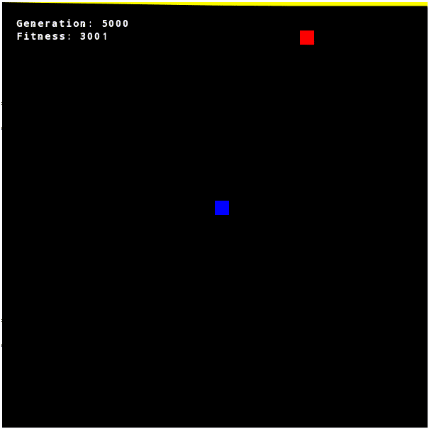

# SmartSnake - Snake game using neural network and genetic algorithm 

This program trains a neural network to play a game of snake using a genetic
algorithm.

# Results 

As can be seen, the fitness improves with higher generations. This is true for
the best fitness within a generation as well as the sum of the fitness values
for all individuals.




# Dependencies

| Dependency                                                    | Version | Use Case                                        |
| ----------                                                    | ------- | --------                                        |
| [eigen](http://eigen.tuxfamily.org/index.php?title=Main_Page) | 3.3.4-4 | Neural network computations and game simulation |
| [SFML](https://www.sfml-dev.org/)                             | 2.4-2   | Game visualization                              |

# Building and running

The included `Makefile` can be used with the command `make` to build all
executables. 

Executing `main` starts the genetic algorithm and saves the result in the
`Results` folder (create it, if it is not present yet (`mkdir Results`)). The
`play_individual` executable can then be used to evaluate and visualize the best
individual of a given generation by using 

```
./play_individual <number_of_generation>
```

The other executables are only used for the testing of the individual classes
within the project. 

The bash script `fitness_plots.sh` plots the best fitness values and the sum of
the fitness values over all generations (requires `gnuplot`).

# How the program works 

## Overview

The program trains a neural network to play the snake game. The neural network
has two hidden layers. Training the network is done by a genetic algorithm. 

## Genetic algorithm

The parameters than can be varied by the genetic algorithm are the weights of
the neural network. The algorithm uses roulette wheel selection to select
individuals as parents. The parents produce children by single point crossover
and mutations. The parents make up the first half of the individuals in the next
generation and the children make up the second half. This ensures that well
performing parents remain in the population even when their children perform
poorly. 

## Fitness function

The fitness of each individual is evaluated by simulating game of snake. The
fitness increases slightly for each step taken by the snake. This promotes
individuals that survive the longest which is especially important for early
generations. When the snake hits the wall or itself the game is over and the
fitness value decreases. Eating the food increases the length and the fitness
value of the snake. The genetic algorithm evaluates each individual several
times and uses the mean fitness value of these simulations as fitness value.
This accounts for the random nature of the food positioning and decreases the
impact of luck. However, it increases the computation time significantly

## Inputs for the neural network

The inputs for the neural network are the relative position between the head of
the snake and the food. Additionally, the distance between food and head of
snake as well as the direction of movement of the snake are used as inputs. To
make the network aware of the immediate surroundings of the snake, three
additional inputs are used. The indicate whether there is wall or another part
of the snake on the tile in front, to the left, or to the right of the head of
the snake. So the network knows, turning in this direction will result in game
over. 


## Outputs of the neural network

The network has three outputs. The highest output determines the next move of
the snake where the third output means that it keeps moving in the same
direction. The first and second output let the snake turn to the left or right
respectively. 

# Outlook

This program is a prove of concept that such a setup works and produces well
performing individuals. However, it is by no means extremely efficient. The
mutation rate and crossover rate can be further adopted to improve the trade off
between exploitation and exploration. The number of starting individuals and
individuals in each generation can be further improved as well. Additionally,
the program can be changed in such a way that the snake can move through the
wall as a variation. The architecture of the network can be optimized, such as
the number of neurons, number of hidden layers or the activation functions. The
results do not show a saturation of fitness value, so an increase in generation
number might further improve the result.  Finally, the code can be further
optimized to reduce computation times. 
